<div align=center></div>

[](#)
[](#) 
[](https://cocoapods.org/pods/JXCategoryView)
[](#) 

A powerful and easy to use category view (segmentedcontrol, pagingview, pagerview, pagecontrol, scrollview) 

Advantages compared to other similar third libraries:
- Use POP (Protocol Oriented Programming) to encapsulate the indicator logic, which can be easy to complete a custom indicator effect;
- Provide more comprehensive and rich effects, and the interaction is smoother;
- Use subclassing to manage cell styles, with clearer logic and simpler extensions;

## Preview

### Indicator preview

Description | Gif |
----|------|
LineView NormalStyle  |   |
LineView JDStyle  |  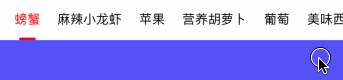 |
LineView IQIYIStyle  |   |
BallView QQRedDot  |   |
TriangleView BottomTriangle  |   |
TriangleView TopTriangle  |  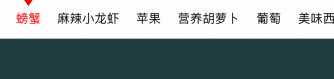 |
BackgroundView Ellipse  |   |
BackgroundView Rectangle |  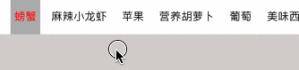 |
BackgroundView MaskWithBG  |  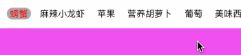 |
BackgroundView MaskWithoutBG  |  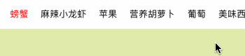 |
ImageView Bottom(boat)  |  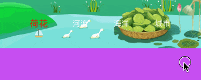 |
ImageView background(Best Male)  |   |
ImageView Roll(football)  |   |
Mixed |   |
indicatorCutomize-DotLine |  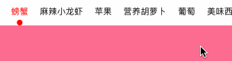 |

JXCategoryIndicatorLineView、JXCategoryIndicatorImageView、JXCategoryIndicatorBallView、JXCategoryIndicatorTriangleView both support change positon bottom or top。

### Cell style preview

Description | Gif |
----|------|
TitleLabel color gradient  |   |
TitleLabel zoom  |   |
Cell bgcolor gradient  |  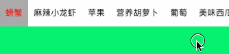 |
separator line |   |
TitleImage_Top |  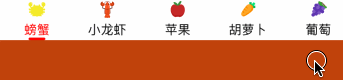 |
TitleImage_Left |  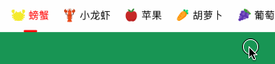 |
TitleImage_Bottom |  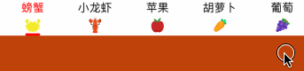 |
TitleImage_Right |   |
Image |   |
number |  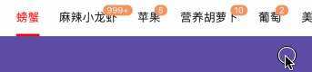 |
reddot |  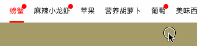 |
customize-multi lines+attributeText |  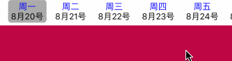 |

### Special preview

Description | Gif |
----|------|
SegmentedControl |  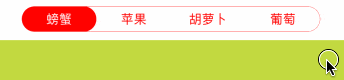 |
In navigationbar |   |
nest |  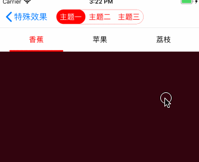 |
both horizontal vertical scrollable、section header view suspend |  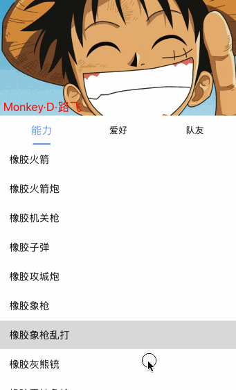 |


## Requirements

- iOS 8.0+
- Xcode 9+
- Objective-C

## Installation

### Manual

Clone repo，drop Sources folder into your project，#import "JXCategoryView.h"，then enjoy it；

### CocoaPods

```ruby
target '<Your Target Name>' do
pod 'JXCategoryView'
end
```

## Structure

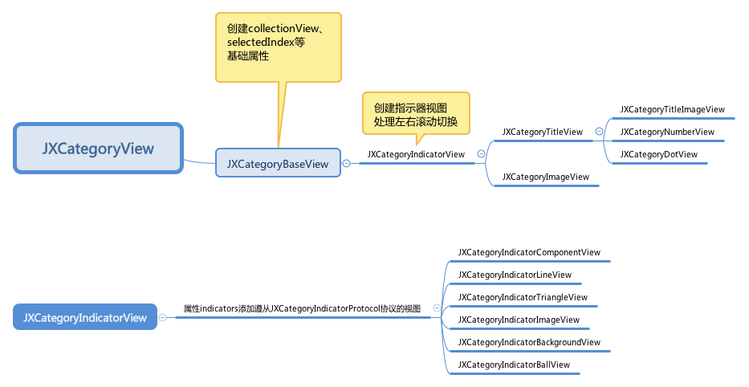

- indicator customize：use POP(Protocol Oriented Programming)to encapsulate the indicator logic，obey`JXCategoryIndicatorProtocol`，implement protocol functions。refer：JXCategoryIndicatorLineView；
- Cell customize：use subcalss to implement. refer：JXCategoryNumberView；

## Special tips

- Customization: Even if flexible extensions are provided, my source code is not likely to satisfy all situations. It is recommended that you can maintain your own set of effects through the fork repository. You can also drag directly into the source file to modify it.
- The both horizontal vertical scrollable、section header view suspend effect，use this repository[JXPagingView](https://github.com/pujiaxin33/JXPagingView)。

## Property Description

### JXCategoryView Property Description

Property    |  Description           |
--------------|---------------|
defaultSelectedIndex | The default selected index, used to specify an index when initializing |
selectedIndex | read-only property, currently selected index |
cellWidth | cell width, default: JXCategoryViewAutomaticDimension |
cellSpacing | spacing between cells, default 20 |
cellWidthIncrement | cell width compensation value, default 0 |
averageCellWidthEnabled | Whether the cellWidth is evenly divided when the total width of the cell content is less than the width of the JXCategoryBaseView. The default is YES. |
contentScrollView | needs associated contentScrollView, internal KVO `contentOffset` |

### Cell style property description

Property | Description |
--------------|---------------|
titleColor | titleLabel unselected color Default: [UIColor blackColor] |
titleSelectedColor | titleLabel selected color Default: [UIColor redColor] |
titleFont | titleLabel's font Default: [UIFont systemFontOfSize:15] |
titleColorGradientEnabled | The color of the title is a gradual transition Default: NO |
titleLabelMaskEnabled | titleLabel mask filtering Default: NO |
titleLabelZoomEnabled | titleLabel whether to scale Default: NO |
titleLabelZoomScale | citleLabel scaling Default: 1.2 |
imageZoomEnabled | whether imageView is scaled Default: NO |
imageZoomScale | imageView scaling Default: 1.2 |
separatorLineShowEnabled |  Default: NO (color, width and height can be set) |
JXCategoryTitleImageType | Image location: top, left, bottom, right Default: left |

### Indicator Property Description

Property | Description |
--------------|---------------|
JXCategoryIndicatorComponentView.componentPosition | Location of the indicator Default: Bottom |
JXCategoryIndicatorComponentView.scrollEnabled | Whether to allow scrolling when gesture scrolling or tapping, default YES |
JXCategoryIndicatorLineView.lineStyle | Normal, Jingdong, iQiyi effects Default: Normal |
JXCategoryIndicatorLineView.lineScrollOffsetX | Exclusive for iQI effects, the offset of x when scrolling, default is 10;
JXCategoryIndicatorLineView.indicatorLineWidth | default JXCategoryViewAutomaticDimension (equal to cellWidth) |
JXCategoryIndicatorLineView.indicatorLineViewHeight | Default: 3 |
JXCategoryIndicatorLineView.indicatorLineViewCornerRadius | Default JXCategoryViewAutomaticDimension (equal to self.indicatorLineViewHeight/2) |
JXCategoryIndicatorLineView.indicatorLineViewColor | defaults to [UIColor redColor] |
JXCategoryIndicatorTriangleView.triangleViewSize | Default: CGSizeMake(14, 10) |
JXCategoryIndicatorTriangleView.triangleViewColor | defaults to [UIColor redColor] |
JXCategoryIndicatorImageView.indicatorImageView | Set image |
JXCategoryIndicatorImageView.indicatorImageViewRollEnabled | Whether to allow scrolling, default: NO |
JXCategoryIndicatorImageView.indicatorImageViewSize | Default: CGSizeMake(30, 20) |
JXCategoryIndicatorBackgroundView.backgroundViewWidth | default JXCategoryViewAutomaticDimension (equal to cellWidth) |
JXCategoryIndicatorBackgroundView.backgroundViewWidthIncrement | Width increment compensation, because backgroundEllipseLayer will generally be larger than the actual content. Default 10 |
JXCategoryIndicatorBackgroundView.backgroundViewHeight | Default JXCategoryViewAutomaticDimension (equal to cell height) |
JXCategoryIndicatorBackgroundView.backgroundViewCornerRadius | Default JXCategoryViewAutomaticDimension (ie backgroundViewHeight/2) |
JXCategoryIndicatorBackgroundView.backgroundViewColor | defaults to [UIColor redColor] |
JXCategoryIndicatorBallView.ballViewSize | Default: CGSizeMake(15, 15) |
JXCategoryIndicatorBallView.ballScrollOffsetX | Offset of small red dot Default: 20 |
JXCategoryIndicatorBallView.ballViewColor | defaults to [UIColor redColor] |

Can be used with multiple IndicatorView, but the effect needs to be controlled by yourself, the effect is not as good as possible. Reference mixed use;

## Usage

```
self.categoryView = [[JXCategoryTitleView alloc] initWithFrame:CGRectMake(0, 0, WindowsSize.width, categoryViewHeight)];
self.categoryView.delegate = self;
self.categoryView.contentScrollView = self.scrollView;
//lineView
JXCategoryIndicatorLineView *lineView = [[JXCategoryIndicatorLineView alloc] init];
//triangleView
JXCategoryIndicatorTriangleView *triangleView = [[JXCategoryIndicatorTriangleView alloc] init];
lineView.indicatorLineWidth = 20;
//ballView
JXCategoryIndicatorBallView *ballView = [[JXCategoryIndicatorBallView alloc] init];
//backgroundView
JXCategoryIndicatorBackgroundView *backgroundView = [[JXCategoryIndicatorBackgroundView alloc] init];

titleCategoryView.indicators = @[lineView, triangleView, ballView, backgroundView];

[self.view addSubview:self.categoryView];
```

- Single cell refresh: For example, in the red dot example, call `- (void)reloadCell:(NSUInteger)index`
- All state resets: When the data source and property configuration change (such as pulling data back from the server), you need to call the `reloadDatas` method to refresh the state.

### Indicator Style Customization

The warehouse comes with: `JXCategoryIndicatorLineView, JXCategoryIndicatorTriangleView, JXCategoryIndicatorImageView, JXCategoryIndicatorBackgroundView, JXCategoryIndicatorBallView`

The main method of implementation:
- Inherit JXCategoryIndicatorComponentView, which internally complies with the `JXCategoryIndicatorProtocol` protocol;
- Implement protocol methods, custom effects:
- `- (void)jx_refreshState:(CGRect)selectedCellFrame`initialize or reloadDatas, reset state;
- `- (void)jx_contentScrollViewDidScrollWithLeftCellFrame:(CGRect)leftCellFrame rightCellFrame:(CGRect)rightCellFrame selectedPosition:(JXCategoryCellClickedPosition)selectedPosition percent:(CGFloat)percent` contentScrollView, when the gesture is swiped, the processing indicator follows the gesture change UI logic;
- `- (void)jx_selectedCell:(CGRect)cellFrame clickedRelativePosition:(JXCategoryCellClickedPosition)clickedRelativePosition` to handle the transition effect according to a selected cell;

Specific example: refer to the `JXCategoryIndicatorDotLineView` inside the demo project.

### Cell Subclassification Considerations

The warehouse comes with: `JXCategoryTitleView, JXCategoryTitleImageView, JXCategoryNumberView, JXCategoryDotView, JXCategoryImageView`

The main method of implementation:
- `- (Class)preferredCellClass` returns a custom cell;
- `- (void)refreshDataSource` refresh the data source, using a custom cellModel;
- `- (void)refreshCellModel:(JXCategoryBaseCellModel *)cellModel index:(NSInteger)index `Reset the data source when initializing and reloadDatas;
- `- (CGFloat) preferredCellWidthWithIndex:(NSInteger)index` returns the corresponding width according to the contents of the cell;
- `- (void)refreshSelectedCellModel:(JXCategoryBaseCellModel *)selectedCellModel unselectedCellModel:(JXCategoryBaseCellModel *)unselectedCellModel`cell is refreshed when selected;
- `- (void)refreshLeftCellModel:(JXCategoryBaseCellModel *)leftCellModel rightCellModel:(JXCategoryBaseCellModel *)rightCellModel ratio:(CGFloat)ratio`cell When the left and right scrolling is switched, the state is refreshed;

Specific example: refer to the `JXCategoryTitleAttributeView` inside the demo project.

#### Inheritance hint

- Any subclassing, view, cell, cellModel must be subclassed, even if a subclass cell does nothing. Used to maintain the inheritance chain, so as not to know who to inherit after subclassing;
- If you completely customize the contents of the cell, then inherit `JXCategoryIndicatorView, JXCategoryIndicatorCell, JXCategoryIndicatorCellModel`, just like `JXCategoryTitleView, JXCategoryTitleCell, JXCategoryTitleCellModel`;
- If you just do some fine-tuning in the parent class, then inherit the target view, cell, cellModel, fine-tune the cell's original controls, or add new controls. Just like `JXCategoryTitleImageView series, JXCategoryTitleAttributeView series`;

### Sliding gesture

First, add the following code to viewDidAppear:
```
- (void)viewDidAppear:(BOOL)animated {
[super viewDidAppear:animated];
self.navigationController.interactivePopGestureRecognizer.enabled = (self.categoryView.selectedIndex == 0);
}
```

#### System returns items by default

- Click processing:
```
#pragma mark - JXCategoryViewDelegate
- (void)categoryView:(JXCategoryBaseView *)categoryView didSelectedItemAtIndex:(NSInteger)index {
self.navigationController.interactivePopGestureRecognizer.enabled = (index == 0);
}
```

#### Custom navigation bar returns Item

- Set the proxy: self.navigationController.interactivePopGestureRecognizer.delegate = (id)self;
- Implement the proxy method:
```
- (BOOL)gestRecognizer:(UIGestureRecognizer *)gestRecognizer shouldRecognizeSimultaneouslyWithGestureRecognizer:(UIGestureRecognizer *)otherGestureRecognizer {
Return YES;
}
```
- Click processing:
```
#pragma mark - JXCategoryViewDelegate
- (void)categoryView:(JXCategoryBaseView *)categoryView didSelectedItemAtIndex:(NSInteger)index {
self.navigationController.interactivePopGestureRecognizer.enabled = (index == 0);
}
```

### contentScrollView

- Flexible layout: JXCategoryView is not strongly associated with contentScrollView, you can even set this property as a simple SegmentedControl. There is no requirement for layout between them. You can put JXCategoryView into the navigation bar, UITableViewSectionHeader and so on.
- Click processing: Because of full decoupling, in the JXCategoryView clickback call, you need to add the following code to scroll the content:
```
#pragma mark - JXCategoryViewDelegate
- (void)categoryView:(JXCategoryBaseView *)categoryView didSelectedItemAtIndex:(NSInteger)index {
[self.scrollView setContentOffset:CGPointMake(self.scrollView.bounds.size.width*index, 0) animated:YES];
}
```

## update record

- 2018.8.12 Release version 1.0.0, update content: Refactor indicator view using POP (protocol-oriented programming); [migration guide] (https://github.com/pujiaxin33/JXCategoryView/blob/master/Migration/1.0 .0.md)

## Supplement

The repository is kept up to date and will be supported for the first time in popular. During the use, if you have any suggestions or questions, you can contact me by:</br>
E-mail: 317437084@qq.com </br>
QQ group: 112440151


like it! star❤️ it!

## License

JXCategoryView is released under the MIT license.
