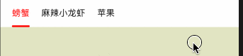
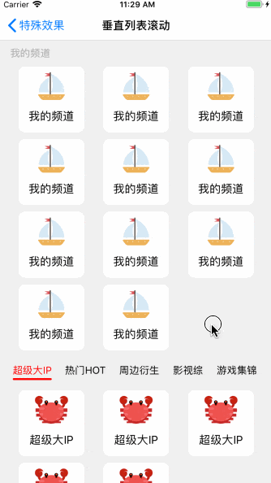
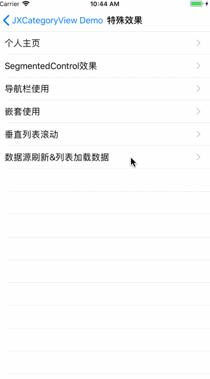

<div align=center></div>

[](#)
[](#) 
[](https://cocoapods.org/pods/JXCategoryView)
[](#) 

A powerful and easy to use category view (segmentedcontrol, segmentview, pagingview, pagerview, pagecontrol) (腾讯新闻、今日头条、QQ音乐、网易云音乐、京东、爱奇艺、腾讯视频、淘宝、天猫、简书、微博等所有主流APP分类切换滚动视图)

与其他的同类三方库对比的优点：
- 使用协议封装指示器逻辑，可以为所欲为的自定义指示器效果；
- 提供更加全面丰富、高度自定义的效果；
- 使用子类化管理cell样式，逻辑更清晰，扩展更简单；

## Swift版本

如果你在找Swift版本，请点击查看[JXSegmentedView](https://github.com/pujiaxin33/JXSegmentedView)

## 效果预览

### 指示器效果预览

说明 | Gif |
----|------|
LineView  |   |
LineView延长  |   |
LineView延长+偏移  |   |
LineView🌈彩虹风格  |   |
DotLineView点线效果 |   |
BallView QQ黏性红点  |   |
TriangleView 三角形底部  |   |
TriangleView 三角形顶部  |   |
BackgroundView椭圆形  |   |
BackgroundView椭圆形+阴影  |   |
BackgroundView长方形  |   |
BackgroundView遮罩有背景  |   |
BackgroundView遮罩无背景  |   |
BackgroundView渐变色  |   |
ImageView底部(小船)  |   |
ImageView背景(最佳男歌手)  |   |
ImageView滚动效果(足球)  |   |
混合使用 |   |

JXCategoryIndicatorLineView、JXCategoryIndicatorImageView、JXCategoryIndicatorBallView、JXCategoryIndicatorTriangleView均支持上下位置切换。

### Cell样式效果预览

说明 | Gif |
----|------|
颜色渐变  |   |
大小缩放  |   |
大小缩放+字体粗细  |   |
大小缩放+点击动画  |   |
大小缩放+cell宽度缩放  |   |
TitleImage_Top |   |
TitleImage_Left |   |
TitleImage_Bottom |   |
TitleImage_Right |   |
cell图文混用 |   |
Image |   |
数字 |   |
红点 |   |
自定义-多行+富文本 |   |
Cell背景色渐变  |   |
分割线 |   |

### 特殊效果预览

说明 | Gif |
----|------|
数据源过少<br/> averageCellSpacingEnabled默认为YES |   |
数据源过少<br/> averageCellSpacingEnabled为NO |   |
SegmentedControl<br/>参考[`SegmentedControlViewController`](https://github.com/pujiaxin33/JXCategoryView/blob/master/JXCategoryView/Example/SegmentedControl/SegmentedControlViewController.m)类 |   |
导航栏使用<br/>参考[`NaviSegmentedControlViewController`](https://github.com/pujiaxin33/JXCategoryView/blob/master/JXCategoryView/Example/SegmentedControl/NaviSegmentedControlViewController.m)类 |   |
嵌套使用<br/>参考[`NestViewController`](https://github.com/pujiaxin33/JXCategoryView/blob/master/JXCategoryView/Example/Nest/NestViewController.m)类 |   |
个人主页(上下左右滚动、header悬浮)<br/>参考[`PagingViewController`](https://github.com/pujiaxin33/JXCategoryView/blob/master/JXCategoryView/Example/PagingView/Example/PagingViewController.m)类<br/> 更多样式请点击查看[JXPagingView库](https://github.com/pujiaxin33/JXPagingView) |   |
垂直列表滚动<br/>参考[`VerticalListViewController`](https://github.com/pujiaxin33/JXCategoryView/blob/master/JXCategoryView/Example/VerticalListView/VerticalListViewController.m)类<br/> 高仿腾讯视频<br/>（背景色异常是录屏软件bug） |   |
数据源刷新&列表数据加载<br/>参考[`LoadDataListContainerViewController`](https://github.com/pujiaxin33/JXCategoryView/blob/master/JXCategoryView/Example/LoadData/LoadDataListContainerViewController.m)类 |   |


## 要求

- iOS 8.0+
- Xcode 9+
- Objective-C

## 安装

### 手动

Clone代码，把Sources文件夹拖入项目，#import "JXCategoryView.h"，就可以使用了；

### CocoaPods

```ruby
target '<Your Target Name>' do
    pod 'JXCategoryView'
end
```
先执行`pod repo update`，再执行`pod install`

## 结构图


## 使用

### 高度自定义使用示例代码

```Objective-C
//在使用JXCategoryView的VC里面加上下面的代码
if (@available(iOS 11.0, *)) {
    self.scrollView.contentInsetAdjustmentBehavior = UIScrollViewContentInsetAdjustmentNever;
}else {
    self.automaticallyAdjustsScrollViewInsets = NO;
}

//1、初始化JXCategoryTitleView
self.categoryView = [[JXCategoryTitleView alloc] initWithFrame:CGRectMake(0, 0, WindowsSize.width, categoryViewHeight)];
self.categoryView.delegate = self;

//2、添加并配置指示器
//lineView
JXCategoryIndicatorLineView *lineView = [[JXCategoryIndicatorLineView alloc] init];
lineView.indicatorLineViewColor = [UIColor redColor];
lineView.indicatorLineWidth = JXCategoryViewAutomaticDimension;
//backgroundView
JXCategoryIndicatorBackgroundView *backgroundView = [[JXCategoryIndicatorBackgroundView alloc] init];
backgroundView.backgroundViewColor = [UIColor redColor];
backgroundView.backgroundViewWidth = JXCategoryViewAutomaticDimension;
self.categoryView.indicators = @[lineView, backgroundView];

//3、绑定contentScrollView。self.scrollView的初始化细节参考BaseViewController类。
self.categoryView.contentScrollView = self.scrollView;
[self.view addSubview:self.categoryView];
```

### `JXCategoryListContainerView`封装类使用示例，强烈建议！！！

- 高度封装contentScrollView逻辑，只需少量代码即可完成列表容器逻辑；
- 列表懒加载，当通过滚动、点击选中显示某个列表的时候，才进行列表初始化，性能更优；

强烈建议先使用`JXCategoryListContainerView`，如果需求比较特殊，再使用上面的高度自定义。
[JXCategoryListContainerView的详细使用说明](https://github.com/pujiaxin33/JXCategoryView/blob/master/Document/JXCategoryListContainerView%E4%BD%BF%E7%94%A8%E8%AF%B4%E6%98%8E.md)

### 其他使用注意事项

- **单个cell刷新：** 比如红点示例里面，调用`- (void)reloadCellAtIndex:(NSUInteger)index`
- **所有状态重置：** 数据源、属性配置有变动时（比如从服务器拉取回来数据），需要调用`reloadData`方法刷新状态。
- **contentScrollView关联说明：** JXCategoryView没有与contentScrollView强关联，你甚至可以不设置这个属性，把它当做简单的SegmentedControl。他们之间布局没有任何要求，可以把JXCategoryView放入导航栏、UITableViewSectionHeader等任何你想要的地方。
- **点击Item之后contentScrollView切换自定义：** 实现协议方法`- (void)categoryView:(JXCategoryBaseView *)categoryView didClickedItemContentScrollViewTransitionToIndex:(NSInteger)index`即可。
- **侧滑手势处理：**[侧滑手势处理说明文档](https://github.com/pujiaxin33/JXCategoryView/blob/master/Document/%E4%BE%A7%E6%BB%91%E6%89%8B%E5%8A%BF%E5%A4%84%E7%90%86.md)
- **自定义建议：** `JXCategoryView`即使提供了灵活扩展，也不可能满足所有情况。未能满足特殊需求的情况，建议通过fork仓库，实现特殊效果。

### 指示器样式自定义

仓库自带：`JXCategoryIndicatorLineView、JXCategoryIndicatorTriangleView、JXCategoryIndicatorImageView、JXCategoryIndicatorBackgroundView、JXCategoryIndicatorBallView`

主要实现的方法：
- 继承JXCategoryIndicatorComponentView，内部遵从了`JXCategoryIndicatorProtocol`协议；
- 实现协议方法，自定义效果：
    - `- (void)jx_refreshState:(JXCategoryIndicatorParamsModel *)model`视图重置状态时调用；
    - `- (void)jx_contentScrollViewDidScroll:(JXCategoryIndicatorParamsModel *)model` contentScrollView在进行手势滑动时，处理指示器跟随手势变化UI逻辑；
    - `- (void)jx_selectedCell:(JXCategoryIndicatorParamsModel *)model`根据选中的某个cell，处理过渡效果；
    
具体实例：参考demo工程里面的`JXCategoryIndicatorDotLineView`

### Cell子类化注意事项

仓库自带：`JXCategoryTitleView、JXCategoryTitleImageView、JXCategoryNumberView、JXCategoryDotView、JXCategoryImageView`

主要实现的方法：
- `- (Class)preferredCellClass`返回自定义的cell；
- `- (void)refreshDataSource`刷新数据源，使用自定义的cellModel；
- `- (void)refreshCellModel:(JXCategoryBaseCellModel *)cellModel index:(NSInteger)index `初始化、reloadData时对数据源重置；
- `- (CGFloat)preferredCellWidthAtIndex:(NSInteger)index`根据cell的内容返回对应的宽度；
- `- (void)refreshSelectedCellModel:(JXCategoryBaseCellModel *)selectedCellModel unselectedCellModel:(JXCategoryBaseCellModel *)unselectedCellModel`cell选中时进行状态刷新；
- `- (void)refreshLeftCellModel:(JXCategoryBaseCellModel *)leftCellModel rightCellModel:(JXCategoryBaseCellModel *)rightCellModel ratio:(CGFloat)ratio`cell左右滚动切换的时候，进行状态刷新；

具体实例：参考demo工程里面的`JXCategoryTitleAttributeView`

#### 子类化注意事项

- 任何子类化需求，view、cell、cellModel三个都要子类化，即使某个子类cell什么事情都不做。用于维护继承链，以免以后子类化都不知道要继承谁了；
- 如果你想完全自定义cell里面的内容，那就继承`JXCategoryIndicatorView、JXCategoryIndicatorCell、JXCategoryIndicatorCellModel`，就像`JXCategoryTitleView、JXCategoryTitleCell、JXCategoryTitleCellModel`那样去做；
- 如果你只是在父类进行一些微调，那就继承目标view、cell、cellModel，对cell原有控件微调、或者加入新的控件皆可。就像`JXCategoryTitleImageView系列、JXCategoryTitleAttributeView系列`那样去做；

## 常用属性说明

[常用属性说明文档地址](https://github.com/pujiaxin33/JXCategoryView/blob/master/Document/%E5%B8%B8%E7%94%A8%E5%B1%9E%E6%80%A7%E8%AF%B4%E6%98%8E.md)

## 更新记录

- 2018.8.21 发布1.0.0版本，更新内容：使用POP（面向协议编程）重构指示器视图；[迁移指南](https://github.com/pujiaxin33/JXCategoryView/blob/master/Migration/1.0.0.md)
- 2018.8.22 发布1.0.1版本，更新内容：删除zoomEnabled,新增titleLabelZoomEnabled、imageZoomEnabled;
- 2018.8.23 发布1.0.2版本，更新内容：添加cellWidthZoomEnabled实现腾讯视频效果;
- 2018.8.24 发布1.0.3版本，更新内容：添加垂直列表滚动效果、指示器添加verticalMargin属性、JXCategoryViewDelegate代理方法优化;
- 2018.9.4 发布1.0.4版本，更新内容：修复bug、添加cell图文混用示例;
- 2018.12.19 发布1.1.7版本，更新内容：添加`JXCategoryListContainerView`，高度封装列表逻辑，支持懒加载列表，提升初始化性能；
- 2019.1.24 发布1.2.2版本，更新内容：非兼容更新接口`- (BOOL)selectCellAtIndex:(NSInteger)index selectedType:(JXCategoryCellSelectedType)selectedType`，自定义有用到该接口的请及时更新。

## 补充

该仓库保持随时更新，对于主流新的分类选择效果会第一时间支持。使用过程中，有任何建议或问题，可以通过以下方式联系我：</br>
邮箱：317437084@qq.com </br>
QQ群： 112440151


喜欢就star❤️一下吧

## License

JXCategoryView is released under the MIT license.
